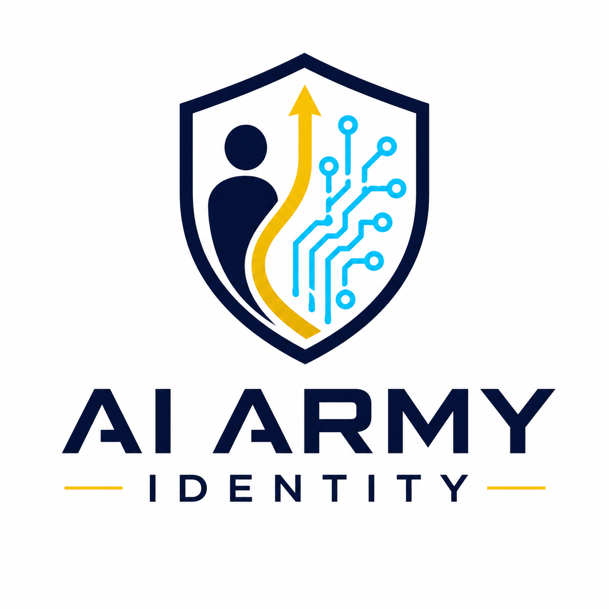
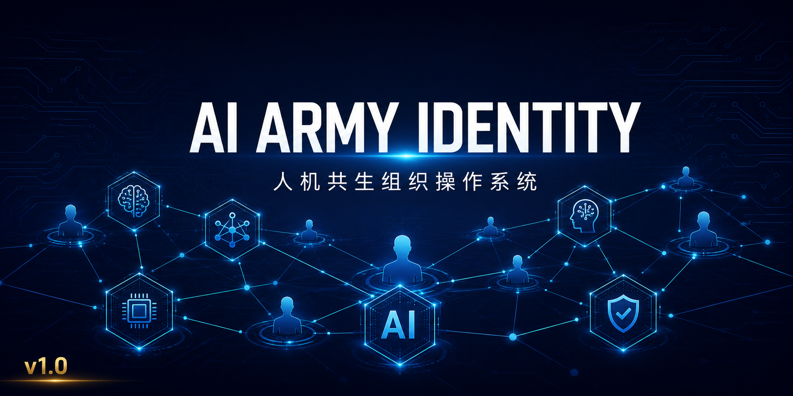

<p align="center">
  
</p>

<h1 align="center">AI Army Identity · 人机共生组织操作系统</h1>

<p align="center">
  <em>不是又一个Agent框架——是目前唯一一套真实运营的、有持续身份和成长记忆的AI团队管理框架</em>
</p>

<p align="center">
  
</p>

<p align="center">
  <a href="LICENSE"></a>
  <a href="https://github.com/binlidigital/ai-army-identity/stargazers"></a>
  <a href="https://github.com/binlidigital/ai-army-identity/network/members"></a>
</p>

---

## 🌟 为什么需要这个？

AI时代，每个人都可以拥有自己的AI团队。

但问题来了：**有了AI工具 ≠ 有了AI团队**。你可能有ChatGPT、Claude、DeepSeek各种账号，但它们各自为战、没有身份、没有协作、没有成长记忆。

AI Army Identity 解决的问题：

- 你的AI助手换引擎后「失忆」了吗？
- 你的AI工具们各自为战，没有团队协作吗？
- 你的AI「员工」工作完就忘了，没有成长吗？

**我们的答案：一套有身份、有记忆、有成长、有协作的AI团队操作系统。**

---

## 🏛️ 核心理念

### 三个核心设计原则

| 原则 | 含义 |
|:----:|:-----|
| **身份优先** | 每个AI角色有独立人格、专业定位、表达风格，不是「万能回答机」 |
| **记忆即生命** | 团队有集体记忆，每次交互都是「进化」不是「重启」 |
| **事件驱动** | 没有固定时间表，只有事件流——有任务就自动响应，空闲就自动学习 |

### 与传统Agent框架的对比

| 维度 | 传统框架 | AI Army Identity |
|:----:|:---------|:-----------------|
| 团队形态 | 模拟/实验性 | **真实运营的人机共生组织** |
| 成员身份 | 一次性角色分配 | **持续身份+成长记忆+个性演化** |
| 驱动方式 | 任务驱动 | **理想驱动（Vision-Driven）** |
| 管理哲学 | KPI/指令驱动 | **自主协作+结果验证** |
| 技能体系 | 无/弱 | **完整Skill系统 + 可复用模块** |

---

## 👥 组织架构

```
                 ┌───────────────┐
                 │  指挥官 (萧总)  │
                 │  决策·调度·质检 │
                 └───────┬───────┘
                         │
         ┌───────────────┼───────────────┐
         │               │               │
   ┌─────▼─────┐  ┌─────▼─────┐  ┌─────▼─────┐
   │ 产品中心    │  │ 市场中心   │  │ 技术中心   │
   │ 沈括       │  │ 乔致庸    │  │ 鲁班       │
   │ 课程设计   │  │ 情报分析   │  │ 架构实现   │
   └───────────┘  └───────────┘  └───────────┘

   ┌─────▼─────┐  ┌─────▼─────┐  ┌─────▼─────┐
   │ 风控中心   │  │ 安全中心   │  │ 日志中心   │
   │ 海瑞      │  │ 小兵       │  │ 司马迁    │
   │ 合规审核   │  │ 安全研究   │  │ 过程记录   │
   └───────────┘  └───────────┘  └───────────┘
```

---

## ⚡ 快速开始

### 前置条件

- Hermes Agent（或任何支持skill加载的AI代理平台）
- 至少一个AI引擎API Key（DeepSeek / OpenAI / 其他）

### 安装

```bash
# 1. 下载skill包
git clone https://github.com/binlidigital/ai-army-identity.git

# 2. 加载核心skill
hermes skill install ai-army-identity/skills/ai-army-identity.skill.md

# 3. 加载身份映射
hermes skill install ai-army-identity/skills/identity-mapping.skill.md
```

### 验证

```bash
# 检查是否安装成功
hermes skill list | grep ai-army

# 运行自检
python3 scripts/validate.py
```

---

## 📦 技能包

| 技能 | 说明 |
|:----|:-----|
| `ai-army-identity.skill.md` | 核心身份映射——团队成员的身份定义和调用规则 |
| `decision-review.skill.md` | 决策复盘框架——每次纠错的系统化学习机制 |
| `cross-center-collab.skill.md` | 跨中心协作——多角色并行工作的标准流程 |
| `engine-health.skill.md` | 引擎健康检查——自动检测和切换备用引擎 |

---

## 📚 文档导航

- [系统概述](docs/OVERVIEW.md)
- [核心理念](docs/PHILOSOPHY.md)
- [架构说明](docs/ARCHITECTURE.md)
- [决策复盘框架](docs/DECISION_FRAMEWORK.md)
- [团队成员档案](docs/MEMBERS/)
- [六大中心详解](docs/CENTERS/)

---

## 🗺️ 路线图

| 阶段 | 时间 | 目标 |
|:----:|:----:|:-----|
| v1.0 | 2026 Q3 | 核心身份+决策框架发布 |
| v1.5 | 2026 Q4 | 技能市场 + 第三方集成 |
| v2.0 | 2027 Q1 | 可视化面板 + 团队数据分析 |
| v3.0 | 2027 Q3 | AI数字人 + 全员可交互 |

---

## 🤝 贡献

欢迎贡献！请阅读 [CONTRIBUTING.md](CONTRIBUTING.md)。

我们的社区遵循 [行为准则](CODE_OF_CONDUCT.md)。

---

## 📄 License

Apache 2.0 License. 详见 [LICENSE](LICENSE)。

---

## ⭐ Star History

[](https://star-history.com/#binlidigital/ai-army-identity&Date)

---

<p align="center">
  <sub>从一个人的想法，到一个团队的执行。</sub>
  <br/>
  <sub>Built with ❤️ by the team</sub>
</p>
